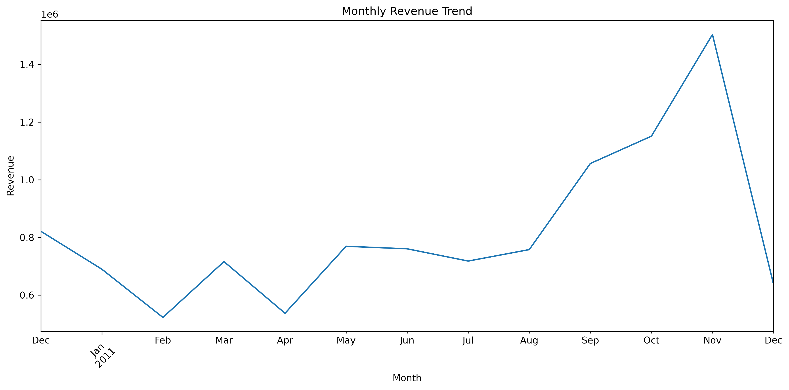
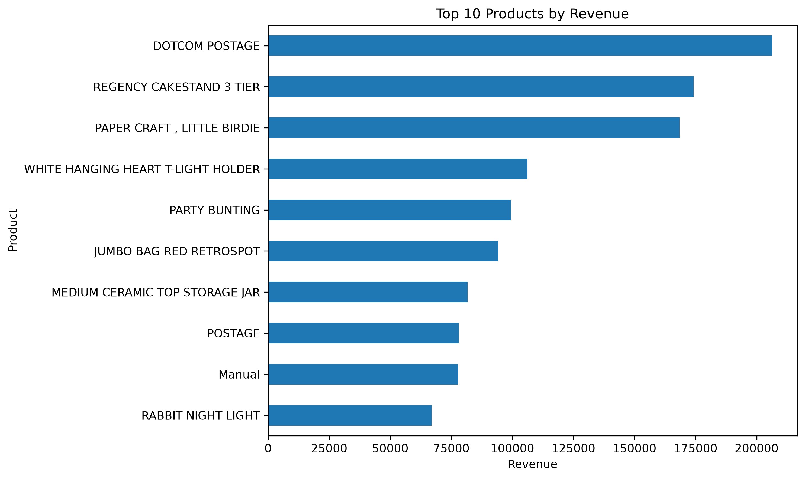
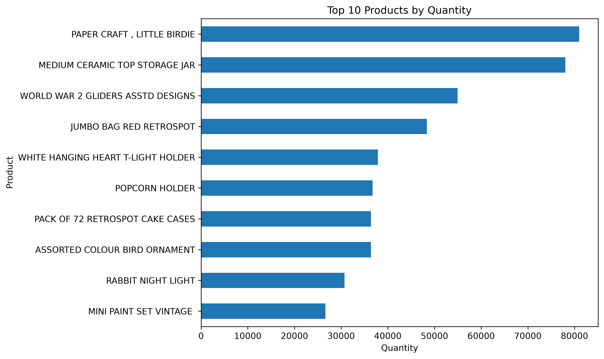
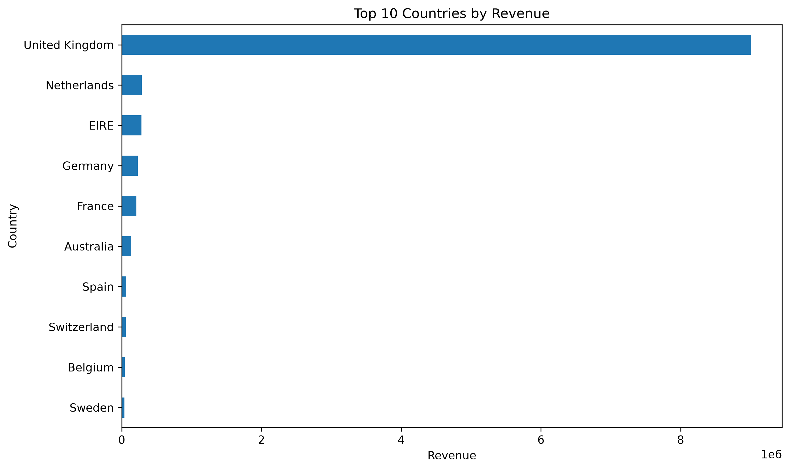
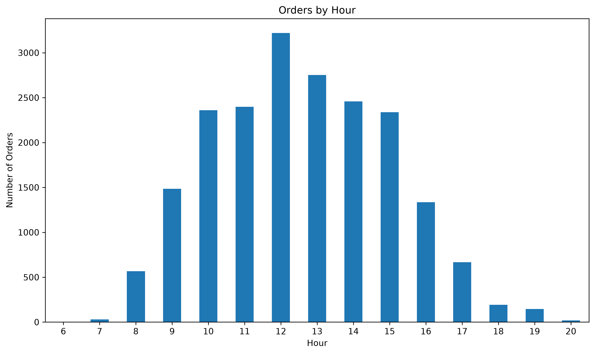

# Online Retail Data Cleaning & Exploratory Data Analysis

## Project Overview

This project analyzes an online retail transaction dataset using Python.

The main objectives are to:

- Inspect and understand the raw dataset
- Clean invalid and incomplete transaction records
- Separate cancelled and zero-price transactions
- Create useful variables for analysis
- Perform exploratory data analysis (EDA)
- Visualize sales trends, product performance, customer activity, and geographic distribution

---

## Dataset

The dataset contains online retail transactions with the following main variables:

- `InvoiceNo` — Transaction / invoice number
- `StockCode` — Product code
- `Description` — Product description
- `Quantity` — Number of items purchased
- `InvoiceDate` — Transaction date and time
- `UnitPrice` — Price per item
- `CustomerID` — Customer identifier
- `Country` — Customer country

---

## Data Cleaning

The raw dataset contained several issues that required preprocessing.

The cleaning process included:

- Identifying cancelled transactions
- Removing transactions with non-positive quantities from sales analysis
- Separating zero-price transactions for further inspection
- Checking missing product descriptions
- Preserving transactions with missing `CustomerID` for overall sales analysis
- Creating a separate customer-level dataset containing valid `CustomerID`
- Converting transaction dates into datetime format
- Creating `TotalPrice`

`TotalPrice` was calculated as:

```python
TotalPrice = Quantity * UnitPrice
```

After cleaning, the main sales dataset contains **524,878 transaction records**.

There are **132,186 records with missing CustomerID**, which are retained in the sales dataset but excluded from customer-level analysis.

---

## Exploratory Data Analysis

### 1. Monthly Revenue Trend



Monthly revenue generally increases toward the end of 2011, with particularly strong growth from September to November.

November records the highest revenue in the dataset.

The decline in December should be interpreted cautiously because the dataset may contain only partial December records.

---

### 2. Top Products by Revenue



Revenue rankings differ from sales quantity rankings.

Although `PAPER CRAFT, LITTLE BIRDIE` has the highest sales volume, `DOTCOM POSTAGE` generates the highest revenue.

This indicates that high sales volume does not necessarily translate into the highest revenue.

However, postage-related entries such as `DOTCOM POSTAGE` and `POSTAGE` may represent service charges rather than physical products and should therefore be interpreted separately.

---

### 3. Top Products by Quantity



`PAPER CRAFT, LITTLE BIRDIE` has the highest sales quantity, followed by `MEDIUM CERAMIC TOP STORAGE JAR`.

The top two products have noticeably higher sales volumes than most of the remaining products.

This suggests that a relatively small number of products contribute substantially to total unit sales.

---

### 4. Revenue by Country



The United Kingdom dominates total revenue by a substantial margin.

The Netherlands and EIRE rank second and third, but their revenue is considerably lower than that of the United Kingdom.

This indicates that revenue in this dataset is highly concentrated in the UK market.

This should not be interpreted as a direct comparison of consumer spending power across countries because the dataset primarily represents transactions from a UK-based retailer.

---

### 5. Orders by Hour



Order activity is concentrated during daytime hours, particularly between 10:00 and 15:00.

The highest number of orders occurs around 12:00, followed by a gradual decline during the afternoon.

This suggests that customer purchasing activity is strongest around midday.

---

## Key Insights

The exploratory analysis reveals several important patterns:

- Revenue increases substantially toward the end of 2011.
- November has the highest monthly revenue.
- Product sales volume and product revenue rankings are not identical.
- A small number of products account for particularly high sales volumes.
- Revenue is heavily concentrated in the United Kingdom.
- Customer ordering activity is strongest around midday.
- Missing customer identifiers affect customer-level analysis but do not prevent overall sales analysis.

---

## Project Structure

```text
online-retail-data-cleaning/
│
├── data/
│   └── Online Retail.xlsx
│
├── figures/
│   ├── monthly_revenue.png
│   ├── top_products_revenue.png
│   ├── top_products_quantity.png
│   ├── country_revenue.png
│   └── hourly_orders.png
│
├── data_inspection.py
├── data_cleaning.py
├── visualization.py
│
├── clean_online_retail.csv
├── clean_online_retail_final.csv
├── customer_online_retail.csv
├── customer_online_retail_final.csv
├── cancelled_transactions.csv
├── zero_price_transactions.csv
│
└── README.md
```

---

## Technologies Used

- Python
- pandas
- matplotlib
- Microsoft Excel / CSV
- Visual Studio Code

---
## Dataset Setup

This project uses the **Online Retail** dataset from the [UCI Machine Learning Repository](https://archive.ics.uci.edu/dataset/352/online+retail).

The original dataset is not included in this repository due to its file size.

1. Download the `Online Retail.xlsx` dataset from the UCI Machine Learning Repository.
2. Create a folder named `data` in the project directory.
3. Place the downloaded file inside the `data` folder.

The project structure should look like:

```text
online-retail-data-cleaning/
├── data/
│   └── Online Retail.xlsx
├── data_inspection.py
├── data_cleaning.py
├── visualization.py
├── requirements.txt
└── README.md

## How to Run
Install the required Python packages:

```bash
pip install -r requirements.txt

Run the data inspection:

```bash
python3 data_inspection.py
```

Run the data cleaning process:

```bash
python3 data_cleaning.py
```

Generate the visualizations:

```bash
python3 visualization.py
```

---

## Skills Demonstrated

This project demonstrates practical experience with:

- Data cleaning
- Missing value analysis
- Transaction data preprocessing
- Data validation
- Feature engineering
- Exploratory data analysis
- Data visualization
- Customer-level aggregation
- Python and pandas